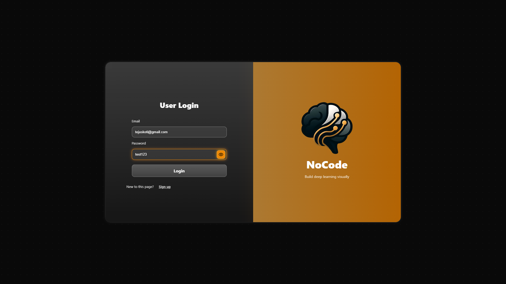
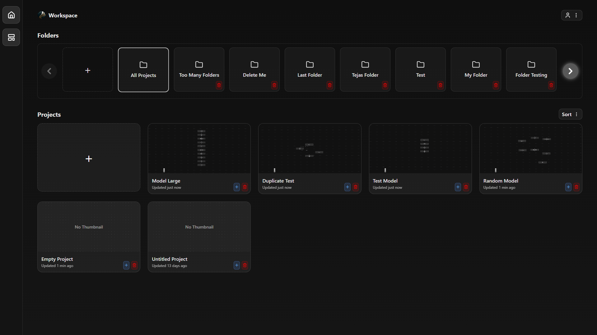
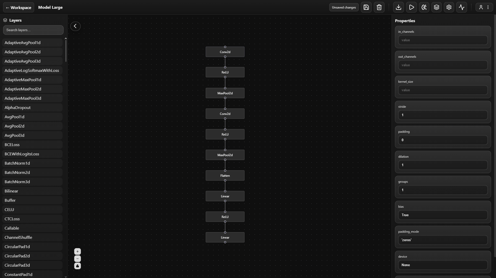
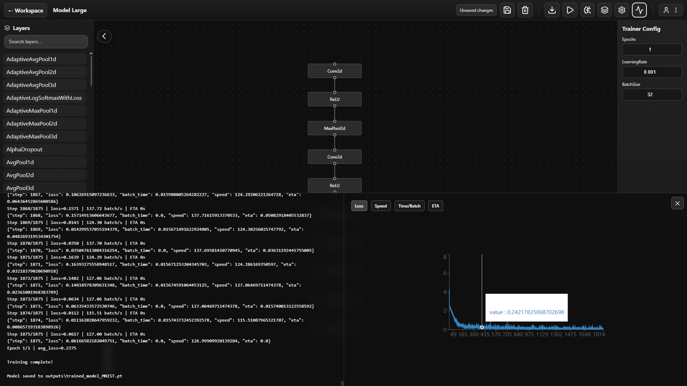
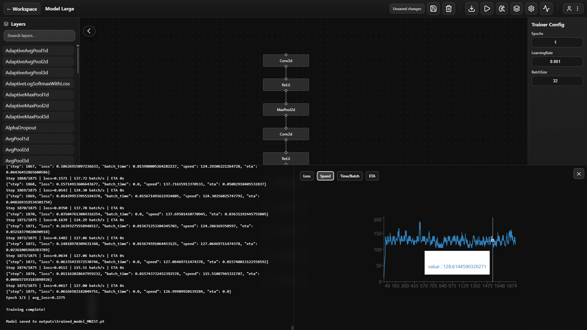

# 🧠 NoCodeStudio — Visual Model Builder & Trainer

NoCodeStudio is a **no‑code / low‑code machine learning studio** that lets you visually design neural networks, generate PyTorch code, train models, and run inference — all from a modern web UI where users can :

- Drag & drop layers to build neural network graphs
- Automatically generate PyTorch code from graphs
- Import and export PyTorch models
- Train models using built‑in or custom datasets
- Use default or custom trainer scripts
- Run inference with JSON inputs
- Manage projects and workspaces
- Execute training & inference in an isolated Python backend (Modal)

NoCodeStudio functions as a **lightweight no-code ML IDE**, powered by a React frontend, TypeScript API, and Python FastAPI training engine.

---

## 🖼 Screenshots

- **Landing Page**  


https://github.com/user-attachments/assets/8ee1df47-e2f3-4fb7-846d-076b00361696


- **Login Page**  
  

- **Workspace Overview**  
  

- **Model Creation / Builder Page**  
  

- **Training Complete**  
  

- **Training Speed & Metrics**  
  


---

## 📂 Project Structure (Current)

```
nocodestudio/
│
├── app/                         # Next.js App Router
│   ├── api/                     # Next.js API routes
│   │
│   ├── login/                   # Login page
│   ├── workspace/               # Workspace (Projects List)
│   ├── [id]/                    # Builder page (Graph Editor)
│   ├── store/                   # Client auth store
│   └── page.tsx                 # Landing page
│
├── lib/                         # Shared server utilities
│   ├── db.ts                    # MongoDB connection
│   ├── auth.ts                  # JWT helpers
│   └── python.ts                # Modal / Python proxy helpers
│
├── pipeline/                    # Modal backend (NOT Wired)
│
├── Extras/                      # Experimental scripts (NOT wired)
│
└── public/                      # Assets & Logos
```

> **Important**
- `pipeline/` runs on Modal and handles all ML logic
- `Extras/` is for experimentation only
- Only `app/` + `lib/` are used by the web app

---

## 🛠 Tech Stack (Updated)

### Frontend + API
- **Next.js 16 (App Router)**
- **React + TypeScript**
- **@xyflow/react** (graph editor)
- **Framer Motion** (animations)
- **MongoDB + Mongoose**
- **JWT Authentication**

### Python / ML Backend
- **Modal** (serverless Python runtime)
- **PyTorch**
- **Torchvision**
- Custom training & inference pipeline
- Graph → code → train → metrics → artifacts

The frontend **never runs Python locally** while everything ML‑related is handled by Modal.

---

## 🚀 Installation & Run

### Step 1: Install and Configure Modal (Required)

Install Modal and authenticate using Windows PowerShell:

```powershell
pip install modal
modal setup
```

Deploy the Python backend service:

```powershell
cd pipeline
modal deploy app.py
```

This will output a public Modal service URL.
You will need this URL in the next step.

### Step 2: Environment Setup

Create a `.env.local` file in the project root and add the following:

```env
MONGO_URI=your_mongodb_connection_string
JWT_SECRET=your_jwt_secret
PY_SERVICE_URL=https://<your-modal-app>.modal.run
```

Make sure the `PY_SERVICE_URL` matches the URL returned by Modal after deployment.

### Step 3: Install Dependencies and Run the App

Install dependencies and start the development server:

```bash
npm install
npm run dev
```

Open the application in your browser:

```
http://localhost:3000
```


---

## 🔌 API Flow 

```
UI (React)
  ↓
Next.js API routes
  ↓
python.ts helpers
  ↓
Modal Python backend
  ↓
PyTorch execution
```

The Node layer **never executes ML** but it only orchestrates.

---

## 📡 API Overview

### Node / Next.js API
- `/api/auth/*` — login / register
- `/api/projects/*` — project CRUD
- `/api/catalog` — available layers
- `/api/layer/:name` — layer parameters
- `/api/export` — graph → PyTorch
- `/api/import` — PyTorch → graph
- `/api/train` — start training
- `/api/run` — inference

### Python (Modal)
- `/catalog`
- `/layer/{name}`
- `/export`
- `/import`
- `/train`
- `/run`
- `/health`

---

## ⚠️ Notes

- Python backend **must be running on Modal**
- `PY_SERVICE_URL` must be correct or catalog/train will 500
- Workspace & builder pages are protected by auth
- This repo is **not the docker containerized version**
- Vercel deployment is supported (frontend only)

---

## 🧩 Customization

- Upload custom trainer scripts in Builder
- Swap datasets without changing UI code
- Extend Python backend freely (Modal scales it)
